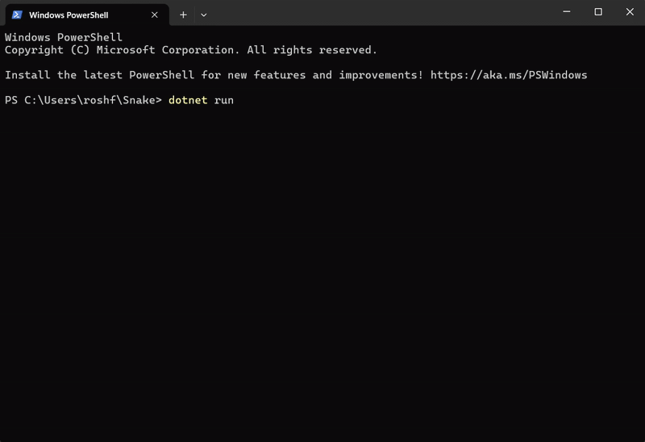
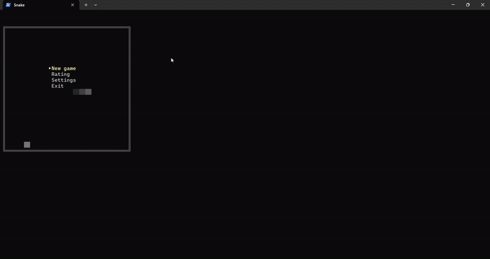

# 🐍 Snake (Console Game) — Study Project

#### Welcome to my personal take on the classic Snake game, built in pure C# for the console. 
#### This project is part of my learning journey to study game architecture, event-driven systems, and clean code principles.




## 🎯 Project Goals
+ Learn event-driven programming (using custom EventManager + EventListeners)

+ Practice manual dependency injection without external libraries

+ Improve object-oriented design (splitting Models, Views, Inputs cleanly)

+ Build a simple menu system and data persistence (saving scores)

## ✨ Features
+ Smooth snake movement (with basic double buffering for flicker-free rendering)

+ Dynamic leaderboard with pages and real-time record display

+ Saving and loading player scores (CSV file storage)

+ Game state management (Pause, Game Over, Menu Navigation)

+ Customizable settings: Speed, Field Size, Continue Previous Game

+ Event-driven architecture for clean separation between input, logic, and rendering

## 🛠️ Patterns and Concepts Used
Concept   |   Description
--- | ---
Observer Pattern | Models like SnakeModel, Field, and Input use event listeners to react to player actions.
Dependency Injection | GameDependencies manually builds and injects all necessary game components.
Separation of Concerns | Controller, View, Input, Field, Snake, and Settings all have distinct responsibilities.
Double Buffering | Frames are built off-screen (in memory) and flushed to the console in one pass for smooth visuals.
Pagination Logic | Leaderboard is split into multiple pages with dynamic navigation and "trailer" for lowest score.

## 📦 Project Structure Overview
```markdown
/Game
  /Controllers       -> Main game loop and input handling
  /EventListeners     -> Event reaction classes (e.g., Eat, Move, GameOver)
  /Input              -> Input reading and event firing
  /Models             -> Snake, Field, Food, Settings, Database
  /Views              -> Rendering menus, gameplay, leaderboard
  GameDependencies.cs -> Manual dependency injection container
/Assets               -> (for GIFs, save files)
/Program.cs           -> Application entry point
/Snake.csproj         -> Project configuration
```
## 🚀 How to Run
You need [.NET 8.0 SDK.](https://dotnet.microsoft.com/en-us/download/dotnet/8.0)

```shell
git clone https://github.com/RustamHolov/Snake.git
cd Snake
dotnet run
```
##### Use WASD or arrow keys to control the snake and  arrow keys to navigate menus.

## 📚 Notes
#### This project is for educational purposes and is actively evolving as I study more advanced programming patterns and game development techniques.

## 📸 Preview 

+ Menu navigation (Start, Settings, Leaderboard)
  


+ Score saving and loading


+ Dynamic speed adjustment


+ Size adjustment




